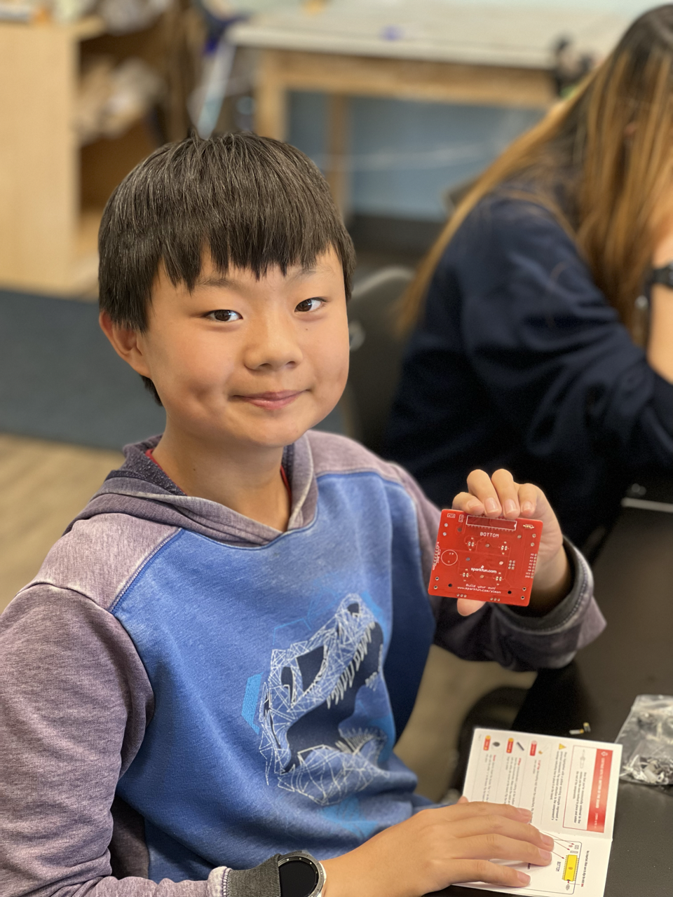
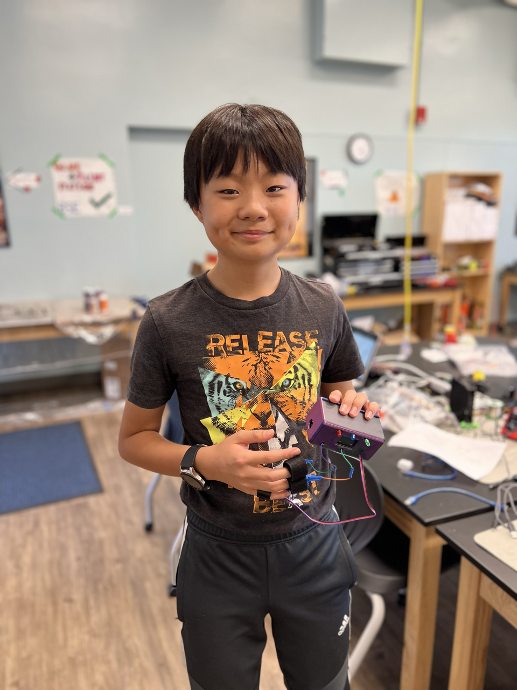

# Lie detector
Have you ever wanted to find out if your sibling(s) are lying about eating all the snacks in the house? Then wonder no further! With this new technology, you can find out if the cookie monster or your sibling(s) ate all the snacks in the house! By measuring galvanic skin response and heart rate, we can find out if someone is lying to you. (most of the time)

| **Engineer** | **School** | **Area of Interest** | **Grade** |
|:--:|:--:|:--:|:--:|
| Christopher Y.| Lynbrook High | Mechanical Engineering | Incoming Freshman

 

# Final Milestone - Algorithm

<iframe width="560" height="315" src="https://www.youtube.com/embed/KSXoCxLHSVI" title="YouTube video player" frameborder="0" allow="accelerometer; autoplay; clipboard-write; encrypted-media; gyroscope; picture-in-picture; web-share" allowfullscreen></iframe>

## Summary: 
I made a box and an algorithm for my Lie Detector. My algorithm calcutlate the users average heart rate and galvanic skin response, then puts those numbers into the average for my lie detector code. My box holds all my components together and makes it look better. Also my algorithm finds my average heart beat and galvanic skin response and replaces my average BPM and GSR in my code with the new average. 

#### Components used:
I used ONshape to design a box for my Lie Detector. 

## Progress:
I just finished coding my algorithm to find my average BPM and GSR before I run my lie detector and I designed a box on ONshape to hold all my components together. 

## Challenges faced:
I have three main issues when making my third milestone. The first issue is my heartbeat sensor's wire broke, so I tried to resolder the wires back onto my heartbeat sensor, however since my heartbeat sensor is really small, and i'm really clumsy, I accidently burnt off some of the other parts on my heartbeat sensor, so I had to get a new one and it worked. My second issue is stuffing all my wires into my box because my box is really small and I had to shorten some wires and break some wires, but I eventually solved the problem. My third issue is needing to combine my algorithm code to my lie detector code, since I had to separate codes. It took a long time to combine the codes but I eventually got it. 

## Next Steps:
If I had more time, I would add a blood pressure sensor. And I could also add a system that deletes my previous BPM display because currently sometimes I get a new heartbeat too fast and it displays right over my previous heart beat and it looks really messy. 

# Second Milestone - Heartbeat Sensor

<iframe width="560" height="315" src="https://www.youtube.com/embed/hQsp0eu9h-I" title="YouTube video player" frameborder="0" allow="accelerometer; autoplay; clipboard-write; encrypted-media; gyroscope; picture-in-picture; web-share" allowfullscreen></iframe>

## Summary:
I made a heartbeat sensor which can find your heartbeat by shinning a green light onto your finger and reflecting it back onto a photosensor and finds the amount of blood in my finger. My pulsesensor gets my heart beat and gives the information on when my heart beats and my average BPM to my OLED screen. Then my OLED screen displays my heart beat and displays a chart that shows when my heart beats. 

#### Components used:
I added a pulsesensor and an OLED screen. 

## Progress:
I am fully done with the important parts of my lie detector that can see if someones lying. 

## Challenges faced:
I faced two main challenges, which are needing to combine two codes together and my delays for my LEDs causing my heartbeat monitor and galvanic skin response to measure slower. I solved my first problem, combining two codes together, by making a state machine which is basically a plan that states what should go in what order for my lie detector and heartbeat sensor. After that, I slowly implemented my state machine into my code by slowly combining both codes together and it turned out working. For my second problem, I needed my delays to run without delaying my arduino because my delays stop my entire arduino for a bit and that will cause my heart rate and lie detector to pause for a bit which would slow it down, so I researched it and found out the millis command which is basically the delay command without pausing, however I couldn’t get the command to work, so I just made it so that when one LED would turn on, it would turn off all the other LEDs.

## Next Steps:
I want to make a box around my lie detector so it looks more professional and I would also like to add a basic algorithm that changes depending on if the person im testing sweats a lot, has a high resting heart beat or gets nervous easily.

# First Milestone - Lie Detector

<iframe width="560" height="315" src="https://www.youtube.com/embed/StfrcpoQP14" title="YouTube video player" frameborder="0" allow="accelerometer; autoplay; clipboard-write; encrypted-media; gyroscope; picture-in-picture; web-share" allowfullscreen></iframe>

## Summary:
I made a Lie Detector which is an arduino based project that can tell if you are telling the truth or lying by using the persons galvanic skin response which is the bodies electricity conductivity. The arduino is a board that gives instructions to all the other parts in the system using the code I put into the app. The wires connect the parts of the arduino to other places like the resistors or the columns. The resistors limit the electricity into the LED lights, so they don't die. And the breadboard connects the rows and columns together. 

#### Components used:
The arduino is a board that has code from a computer and physical bits that you can connect wires to. The breadboard connects columns together and connects rows together. There are four resistors, three of them are 2.2k and one of them is 10k, resistors limit the amount of electricity that travels through. The LED's light up when coded to through a device, LED lights work by having electricity flow through a microchip which illuminates a light. The wires just connect everything together. In summary, I used an arduino, a breadboard, four resistors, and three LEDS. 

## Progress:
I just finished my lie detector that can detect if someones lying

## Challenges faced:
When I was done with my wiring, I tested my LED’s and only my green one turned on. I tried using different wires, testing my resistors, testing if my other LEDs  were broken, I checked the docs, and I checked if I wired everything correctly. Turns out my breadboard wasn’t working after I tested if different places on my breadboard connected to each other. At last, I realized only half my breadboard. So I got a new breadboard that worked. 

## Next Steps:
I plan on adding a heart rate detector, I'm probably going to solder my wires on soon. I might add a case to my breadboard. Also I might add an algorithm that changes depending on different peoples galvanic skin response and heart rate. 

# Starter Project - Simon Says

<iframe width="560" height="315" src="https://www.youtube.com/embed/cEyCkOh2ClY" title="YouTube video player" frameborder="0" allow="accelerometer; autoplay; clipboard-write; encrypted-media; gyroscope; picture-in-picture; web-share" allowfullscreen></iframe>
 
## Summary:

#### Explanation:
The Simon Says project is a memory game. 

#### Components used:
There are two batteries powering the simon board, inside the four buttons, there are four LEDs that light up when told to through code. Behind the LED's, there's a microcontroller which basically registers which buttons I press and if I should continue or restart. Inside my simon board there is also a resistor which limits the flow of electrical current that's flowing through, there is also a buzzer that makes a loud noise when I loose. Lastly there is a decoupling cap which filters out the voltage spikes in my simon board. So in summary, I used two batteries, four buttons, four LEDs, a microcontroller, resistor, a buzzer, and finally a decoupling cap. 

#### How the components work together:
When I press buttons, the microcontroller registers them, giving the LEDs instructions, and gives the buzzer instructions, for example if I lost, then the buzzer will buzz and the LEDs will stop lighting up. The batteries give electricity into the decoupling caps, the decoupling caps remove all the voltage spikes that are getting put through the system, then the decoupling caps move the electricity into the resistors. The resistors limit the electricity and transports it to the microcontroller, the buzzer, and the LEDs. 

## Progress:
I finished my starter project, and am going to start on my first milestone. 

## Challenges faced:
When I finished everything, one of the lights on my simon board didn't flash. I first tried using a multimeter to see if I put my LED on wrong but I didn’t. Later I found out that the problem was that the solder I put on didn't connect the LED light properly. 

## Next Steps:
I am planning on making a lie detector. 

# CAD Design

This is my CAD design link: [Link](https://cad.onshape.com/documents/3ba0a5e8628ea6f2311e0273/w/f3892129fdbb3340f6cfe332/e/1157ac02c916d4a12a24daf8)

<!-- # Schematics -->

# Code

Here is my code for the intensive project:

<pre style="background:#fdfdfd; border:none; height:40pc">
#Testing 123
</pre>

# Bill of Materials

| **Part** | **Note** | **Price** | **Link** |
|:--:|:--:|:--:|:--:|
| Heartbeat Sensor | Finding Your Heart Beat | $24.99 | <a href="https://pulsesensor.com/products/pulse-sensor-amped"> Link </a> |
| Reynolds Wraps| Lie Detector| $2.99 | <a href="https://www.amazon.com/Reynolds-Wrap-Aluminum-Foil-30/dp/B005GPJCHQ"> Link </a> |
| Arduino Bano Every | Microcontroller | $13.70 | <a href="https://store.arduino.cc/products/arduino-nano-every?selectedStore=eu"> Link </a> |
| Velcro Roll | Wrap Around My Fingers | $1.28 | <a href="https://www.amazon.com/ELEYY-164ft-Hook-Cable-Straps/dp/B09BFWT1MW"> Link </a> |

